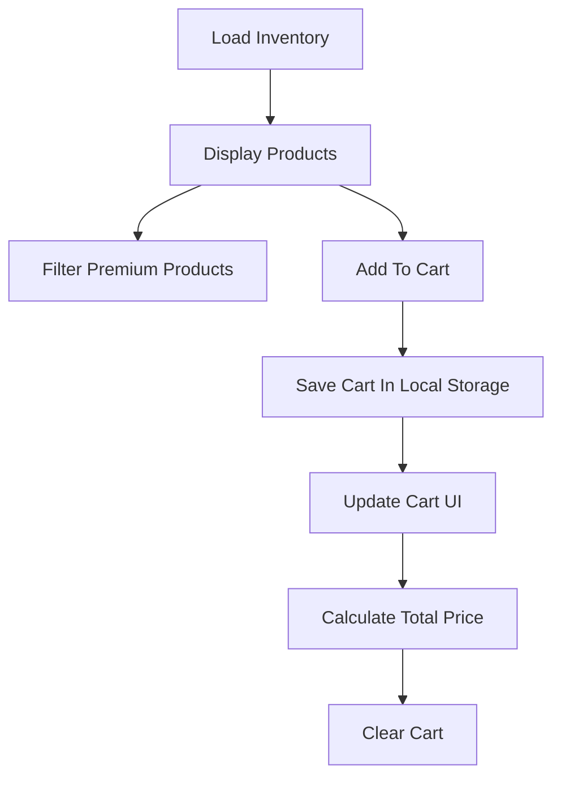

<div align="center">

# 🛒 Full-Stack Product Engine

### A modern E-Commerce Dashboard built with HTML, CSS & JavaScript

[]()
[]()
[]()
[]()

<br>

### ⚡ Live Inventory • 🛍️ Cart Session • 💾 Local Storage

</div>

---

## ✨ Features

✅ Load Live Inventory

✅ Filter Premium Products (> ₹500)

✅ Add Products to Cart

✅ Automatic Total Price Calculation

✅ Persistent Cart using Local Storage

✅ Clear Cached Cart

✅ Responsive Dashboard UI

---

## 📸 Preview

<p align="center">

</p>

---

## 🧠 Concepts Used

<table>
<tr>
<td>Async/Await</td>
<td>Fetch API</td>
</tr>

<tr>
<td>Array.map()</td>
<td>Array.filter()</td>
</tr>

<tr>
<td>find()</td>
<td>for...of Loop</td>
</tr>

<tr>
<td>DOM Manipulation</td>
<td>Template Literals</td>
</tr>

<tr>
<td>Event Listeners</td>
<td>Local Storage</td>
</tr>

</table>

---

# 🏗️ Project Structure

```bash
📦 Full-Stack-Product-Engine
│
├── index.html
├── style.css
└── script.js
```

---

# ⚙️ Workflow



---

## 🛠 Tech Stack

<p align="center">


</p>

---

## 🚀 Getting Started

### Clone Repository

```bash
git clone https://github.com/yourusername/full-stack-product-engine.git
```

### Open Project

```bash
cd full-stack-product-engine
```

Simply open:

```bash
index.html
```

---

## 📚 What I Learned

- Working with Fetch API
- Asynchronous JavaScript
- Array Methods
- DOM Manipulation
- Event Handling
- Local Storage
- Building Responsive Layouts

---

## 🌟 Future Improvements

- [ ] Quantity Controls
- [ ] Remove Single Item
- [ ] Search Products
- [ ] Dark/Light Theme Toggle
- [ ] Backend Integration
- [ ] User Authentication
- [ ] Checkout Page

---

<div align="center">

### ⭐ If you like this project, give it a star!

Made with ❤️ by **Jahnvi Srivastava**

</div>
